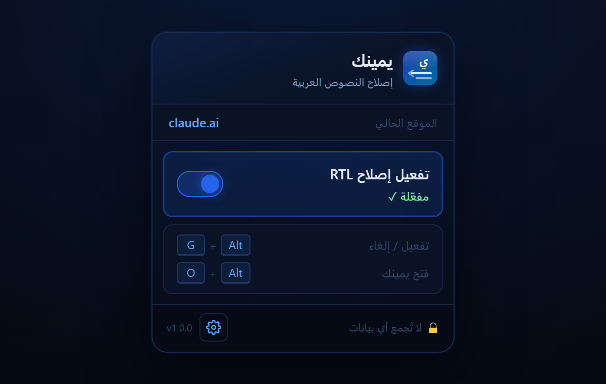
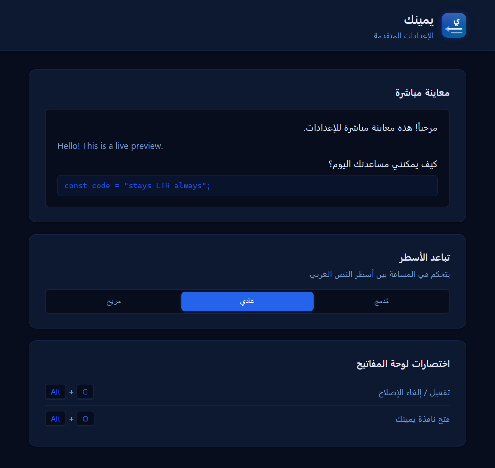
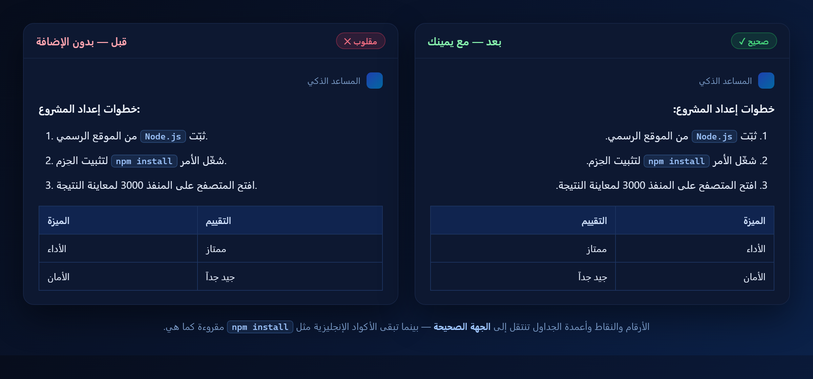

<div align="center">


[]([https://addons.mozilla.org](https://addons.mozilla.org/en-US/firefox/addon/يمينك-arabic-rtl-fix/)
[](https://developer.mozilla.org/en-US/docs/Mozilla/Add-ons/WebExtensions/manifest.json)
[](LICENSE)
[](https://github.com/7SMS)

**إصلاح ذكي لاتجاه النص العربي في مواقع الذكاء الاصطناعي**  
*Smart Arabic RTL fix for AI chat sites · zero layout breakage · zero data collection*

</div>

---

## نظرة سريعة / Overview

كثير من مواقع الدردشة الذكية تعرض النص العربي بترتيب مقلوب: الأرقام والنقاط وعلامات الترقيم في الجهة الخاطئة، وأعمدة الجداول معكوسة. **يمينك** يصلح هذا تلقائياً دون أن يكسر تصميم الموقع.

Many AI chat sites render Arabic with numbers, bullets and table columns on the wrong side. **Yameenk** fixes this automatically, without breaking the site's layout.

---

## المواقع المدعومة / Supported Sites

يعمل **تلقائياً** فور فتح أي من هذه المواقع:

`claude.ai` · `chatgpt.com` · `gemini.google.com` · `chat.deepseek.com` · `notion.so` · `perplexity.ai` · `copilot.microsoft.com` · `grok.com`

---

## لقطات الشاشة / Screenshots

<div align="center">
<table>
<tr>
  <td align="center"><br><sub>نافذة التحكم</sub></td>
  <td align="center"><br><sub>الإعدادات</sub></td>
</tr>
<tr>
  <td align="center" colspan="2"><br><sub>قبل وبعد التفعيل / Before and after</sub></td>
</tr>
</table>
</div>

> صورة **قبل/بعد** توضّح كيف تنتقل أرقام القوائم والنقاط وأعمدة الجداول إلى الجهة الصحيحة، بينما تبقى الأكواد الإنجليزية مقروءة كما هي. / The **before/after** image shows list numbers, bullets and table columns moving to the correct side, while English code stays readable.

---

## المميزات / Features

| | العربية | English |
|---|---|---|
| ⚡ | تشغيل تلقائي على المواقع المدعومة | Auto-enabled on supported sites |
| 🎯 | يستهدف النص العربي فقط دون لمس واجهة الموقع | Targets Arabic text only, never the site UI |
| 🔢 | أرقام ونقاط القوائم في الجهة الصحيحة | Numbers and bullets on the correct side |
| 📊 | ترتيب أعمدة الجداول من اليمين | Right-to-left table columns |
| 🔤 | يبقي المصطلحات والأكواد الإنجليزية مقروءة | Keeps English terms and code readable |
| 🔄 | يعمل على المحتوى الجديد أثناء الكتابة | Works on streaming/dynamic content |
| ⌨️ | اختصارات لوحة المفاتيح | Keyboard shortcuts (Alt+G / Alt+O) |
| 📏 | تحكّم بتباعد الأسطر | Line-spacing control |
| 🔒 | خصوصية كاملة (تخزين محلي فقط) | Privacy-first (local storage only) |

---

## كيف يعمل / How It Works

بدلاً من فرض `direction: rtl` على الصفحة كاملة (يخرّب التصميم)، يعلّم يمينك بالـ JavaScript **العناصر العربية فقط** (فقرات، عناوين، قوائم، جداول) ثم يطبّق عليها:

```css
direction: rtl;
unicode-bidi: isolate;   /* يحاذي يميناً ويعزل المقاطع اللاتينية فتبقى مقروءة */
text-align: start;
```

- العناصر الإنجليزية وواجهة الموقع لا تُلمس → لا انقلاب ولا تزحزح.
- الأكواد (`pre`, `code`, `kbd`, `samp`, `var`) تبقى LTR دائماً.
- مُراقب (MutationObserver) يعالج الرسائل الجديدة فور ظهورها.

---

## الاختصارات / Shortcuts

| الاختصار | الوظيفة |
|---|---|
| `Alt + G` | تفعيل / إيقاف الإصلاح للموقع الحالي |
| `Alt + O` | فتح نافذة يمينك |

---

## التثبيت للمطوّرين / Dev Install (Firefox)

```text
1. افتح about:debugging في فايرفوكس
2. اضغط This Firefox  ثم  Load Temporary Add-on
3. اختر ملف manifest.json
```

---

## الصلاحيات / Permissions

| الصلاحية | السبب |
|---|---|
| `storage` | حفظ الإعدادات وحالة المواقع محلياً |
| `tabs` | معرفة الصفحة الحالية لتطبيق الإصلاح أو إيقافه |
| Content Scripts | تعمل فقط على المواقع المدعومة المذكورة أعلاه |

لا توجد `host_permissions` واسعة، ولا وصول لكل المواقع.

---

## بنية الملفات / Structure

```text
extension-RTL/
├── manifest.json       إعدادات الإضافة (Manifest V3)
├── background.js       الاختصارات وحالة التبويبات
├── content.js          حقن CSS + تمييز العناصر العربية
├── popup/              نافذة التحكم
├── options/            صفحة الإعدادات
├── icons/              أيقونات SVG
├── screenshots/        البانر واللقطات
├── privacy-policy.md   سياسة الخصوصية
└── LICENSE             رخصة MIT
```

---

## الخصوصية / Privacy

الإضافة **لا تجمع ولا ترسل أي بيانات**. كل شيء يُخزَّن محلياً عبر `browser.storage.local`.  
التفاصيل: [privacy-policy.md](privacy-policy.md)

---

## الرخصة / License

MIT · Copyright (c) 2026 7SM · انظر [LICENSE](LICENSE)

<div align="center">

**تطوير [7SM](https://github.com/7SMS)** · إذا أفادتك الإضافة ضع ⭐

</div>
